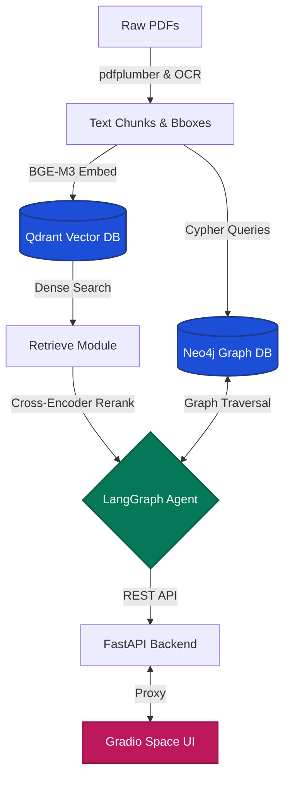

# GraphRAG Aero 🛩️

A Graph RAG system for Aerospace Documents (Transport Canada & TSB reports), supporting English, French, and Chinese.

This project uses a combination of **Dense Retrieval** and a **Neo4j Knowledge Graph** to power a LangGraph agent, exposed through a FastAPI backend and a Gradio UI.

## 🏗️ Architecture

## 🚀 Quickstart

1. **Setup Environment**: Copy `.env.example` to `.env` and fill in secrets.
2. **Start Services**: `docker compose up -d qdrant neo4j postgres ollama otel-collector`
3. **Run App**: `docker compose up --build backend hf-space`
4. **Access UI**: Open [http://localhost:7860](http://localhost:7860)

For the complete documentation, detailed layout, testing, and deployment instructions, see [README-detailed.md](README-detailed.md).
