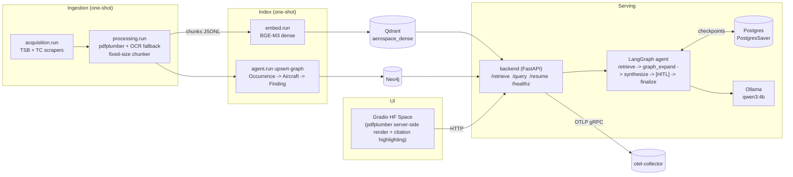

# Architecture

End-to-end Graph RAG pipeline over Transport Canada + TSB aviation
documents. This document explains the data flow, how the components fit
together, the sequential VRAM discipline, and what happens during a
single HITL session.

## Pipeline overview



## Data flow per request

A single `/query` HTTP call traces through the system as follows:

1. **HF Space** POSTs `{query, thread_id, max_hops}` to
   `backend /query`.
2. **Backend** invokes the compiled LangGraph agent. The graph is:
   ```
   START → retrieve → graph_expand → decide_continue
                                          ├── retrieve (another hop, if low confidence)
                                          └── synthesize → [HITL interrupt] → finalize → END
   ```
3. **retrieve node** calls `retrieve.pipeline.retrieve_and_rerank`:
   - BGE-M3 embeds the query (loads ~0.5GB into VRAM via
     `retrieve.vram.ModelSession`).
   - Qdrant dense ANN search returns the top `ann_k` candidates with
     payload filters for `lang` and `source`.
   - `bge-reranker-v2-m3` re-scores the candidates (loads ~0.5GB into
     VRAM); top `top_k` are merged with the running candidate set,
     deduped by `chunk_hash`.
4. **graph_expand node** Cypher-queries Neo4j for graph neighbours of
   the cited occurrences (Aircraft → Findings → Recommendations →
   Regulations → ACs).
5. **decide_continue** picks `retrieve` again if best rerank score <
   threshold AND `hop < max_hops`; else `synthesize`.
6. **synthesize node** unloads the embedder + reranker (frees ~1GB
   VRAM), builds the prompt, and calls Ollama `qwen3:4b` for the draft.
7. **HITL interrupt** — the graph pauses *before* `finalize`. The
   backend returns the paused state to the caller:
   `{thread_id, draft, trace, n_candidates}`.
8. **User edits the draft** (or accepts it) in the UI and POSTs
   `/resume/{thread_id}` with `{draft?: "..."}` (omitted if unchanged).
9. **Backend** resumes the graph; `finalize` copies the (possibly
   edited) draft to `final` and returns. `trace_from_history()` gives
   the full audit log including the pause/resume boundary.

Every node appends a `{node, elapsed_ms, ...}` entry to `state["trace"]`
as it runs; the HF Space UI renders this as a timeline and OTel manual
spans wrap the same boundaries for distributed-trace correlation.

## Sequential VRAM discipline

The system is designed for an **8GB GPU** (e.g. RTX 3060Ti). Three
models share that budget; they do **not** sit in VRAM concurrently:

| Stage | Model | Resident VRAM |
|-------|-------|---------------|
| Embed query | BGE-M3 dense | ~0.5 GB |
| Rerank top-K | bge-reranker-v2-m3 | ~0.5 GB |
| Generate | qwen3:4b Q4_K_M (Ollama) | ~2.5 GB |
| Total **sequenced** peak | | ~3.5 GB |
| Total if concurrent | | ~9+ GB (overflows) |

The discipline is enforced in three places:

1. **`retrieve.vram.ModelSession`** is a context manager that lazily
   loads a model on `__enter__` and unloads it on `__exit__`.
2. **`agent.synthesize_node`** explicitly calls
   `deps.embedder.unload()` and `deps.reranker.unload()` *before*
   asking Ollama to generate, freeing the VRAM Ollama needs.
3. **`backend.Dockerfile`** runs `uvicorn --workers 1`. Multiple
   workers would race for VRAM; the single-worker constraint is
   load-bearing, not stylistic.

## HITL session walk-through

The HITL gate exists so a domain expert (e.g. a safety analyst) can
review the draft before it's "final." Concretely:

1. UI submits the query → backend kicks off the agent → graph runs all
   the way to `synthesize`, produces a draft, then **interrupts** before
   `finalize`.
2. Backend returns the paused state (`thread_id`, `draft`, `trace`).
   The agent's full state lives in Postgres via `PostgresSaver`, so the
   pause can survive a backend restart.
3. UI shows the draft in an editable textbox + the trace timeline + the
   cited chunks with PDF bbox highlights.
4. User clicks **Finalize**. If they edited the draft, the UI POSTs
   `{draft: "<edited>"}`; otherwise `{}`. The backend calls
   `graph.update_state(...)` with the edited draft (no-op for `{}`),
   then `graph.invoke(None, config)` to resume past the interrupt.
5. `finalize_node` copies whatever the current `draft` is to `final`
   and the graph ends.

The audit trail (`trace` + `history` from
`agent.trace.trace_from_history`) records both sides of the
interruption, so it's clear later whether the model's draft or the
human's edit became the final answer.

## Model roles (development)

Per [CLAUDE.md](../CLAUDE.md), commits carry a `Model:` trailer so
`git blame` can attribute each line to the model that wrote it:

| Model | Role |
|-------|------|
| Opus / Sonnet 4.6+ | Phase code-of-record (`.py`, `.ts`, design) |
| Haiku 4.5 | Mechanical work: run commands, install deps, format/lint, corpus pulls |
| gemini-3.5-flash | One-off P4 contribution (graph + agents); flagged in MANIFEST |

The intent is that any future contributor can see exactly which model
authored which piece, and degraded-mode (Haiku-only) sessions queue
phase logic rather than improvising it.

## What's not in here

- **Sparse retrieval** — Qdrant is configured dense-only. Hybrid search
  is intentionally out of scope.
- **Image embeddings (Serving)** — the HF Space is multimodal in *output* (PDF
  page images with bbox highlights), but not query *input*. Vision-Language processing (`Qwen2.5-VL`) is used during *ingestion* to caption figures, but not for live queries.
- **Multi-tenant auth** — single-user local stack.
- **Streaming responses** — the backend returns full paused-state JSON
  at the HITL boundary; SSE would require restructuring the agent loop.
